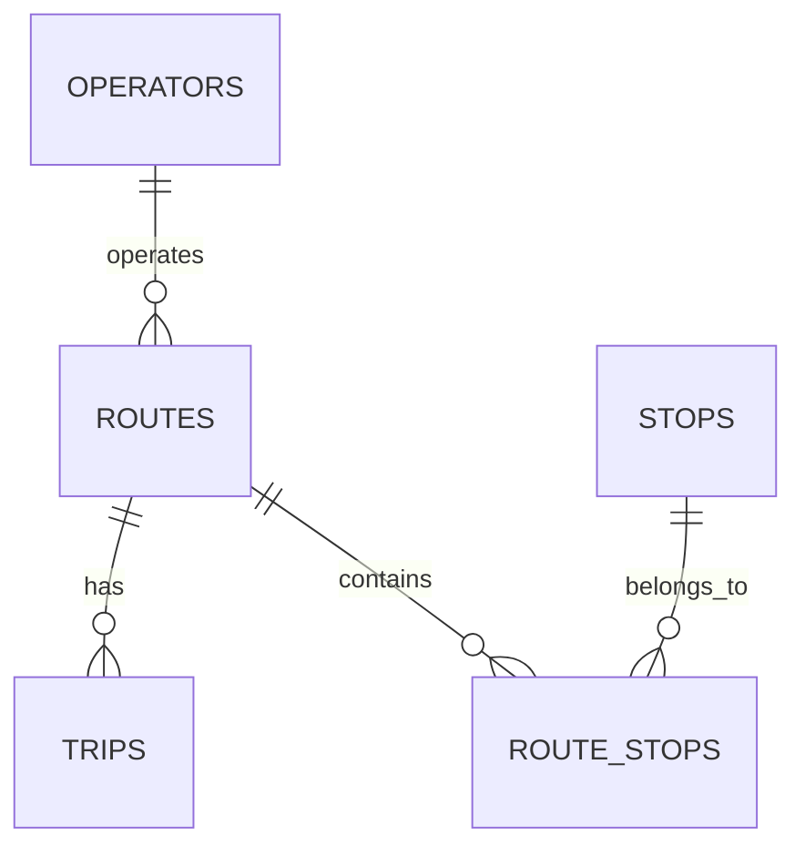

# Lecture 1 - Design Notes

## Workload map

The MobilityTicketing system supports several main access patterns:

* Customers search for routes and timetables.
* Customers purchase tickets.
* Customers validate tickets.
* Operators update routes and timetables.
* The system provides real-time availability information.
* Operators and other users need reporting information.

## Relational model

The main tables are operators, routes, stops, route_stops and trips.

## Modelling decision

A route may visit the same stop more than once. Therefore, `route_stops` uses `(route_id, stop_sequence)` as its primary key. The sequence identifies each occurrence of a stop within a route.

## Functional dependency and normalization

`stop_id -> stop_name` because each stop ID identifies one stop and therefore one name. Keeping the stop name in the `stops` table instead of repeating it in `route_stops` avoids unnecessary duplication and update anomalies.

## What the implementation proves

The current schema supports route-stop relationships, scheduled trips and the three required timetable queries. The seed data can be loaded repeatedly, and the queries can retrieve upcoming trips, ordered stops and routes including routes with no scheduled trips.

## Remaining uncertainty

The current implementation does not prove all business rules of the complete MobilityTicketing system. In particular, ticketing, payment, reporting and migration concerns are handled in later lectures.
